<h1 align="center">HabitStreak</h1>

<p align="center">
  <em>A gamified habit tracker that rewards daily consistency by dynamically upgrading its user interface across 6 escalating visual tiers.</em>
</p>

<p align="center">
  
  
  
  
  
  
  
  
</p>

---

## Motivation

Maintaining consistent daily habits is one of the most effective ways to achieve personal growth, yet building long-term habits is notoriously challenging. Most habit-tracking applications treat consistency like a sterile spreadsheet: static checkboxes, plain tables, and minimal emotional feedback. After the initial novelty wears off, users frequently lose momentum and abandon their routines.

**HabitStreak** was created to transform daily habit formation into an intrinsically rewarding, gamified experience. Rather than treating streaks as just a static number, HabitStreak directly links your consistency to the visual aesthetics of your application:

- **Visual Reinforcement**: As you hit streak milestones (1, 10, 20, 50, 100, and 200+ days), the user interface progressively evolves through 6 distinct visual levels—introducing refined color palettes, polished card designs, glowing accents, and animated fire particle effects.
- **Psychological Momentum**: Gamifying streak growth combines loss aversion with positive reinforcement, making showing up every day engaging, visually satisfying, and fun.
- **Clarity & Reflection**: Built-in analytics and activity logs give users clear insight into their consistency patterns, helping them stay accountable and mindful over time.

---

## Quick Start

Get HabitStreak up and running locally on your machine in just a few minutes.

### Prerequisites

Ensure you have the following installed on your system:
- [Node.js](https://nodejs.org/) (v18 or higher)
- [npm](https://www.npmjs.com/) (bundled with Node.js)
- [MySQL Server](https://www.mysql.com/) (v8.0 or higher)
- [Git](https://git-scm.com/)

---

### 1. Clone the repository

```bash
git clone https://github.com/Xuerns/HabitStreak.git
cd HabitStreak
```

---

### 2. Set up the database

Log into your MySQL client and run the database initialization script:

```bash
mysql -u root -p < backend/DATABASE.sql
```

Alternatively, copy the SQL statements from [`backend/DATABASE.sql`](backend/DATABASE.sql) into your preferred database management tool (such as MySQL Workbench, DBeaver, or phpMyAdmin) to create the `habitStreak` database and required tables.

---

### 3. Backend Setup

1. Navigate to the backend directory and install dependencies:
   ```bash
   cd backend
   npm install
   ```

2. Create an environment configuration file:
   ```bash
   cp .env.example .env
   ```

3. Open `.env` and verify your database and authentication configuration:
   ```env
   PORT=3000
   JWT_SECRET=your_super_secret_jwt_key
   DB_HOST=localhost
   DB_USER=root
   DB_PASSWORD=your_db_password
   DB_NAME=habitStreak
   ```

4. Start the backend development server:
   ```bash
   npm run dev
   ```
   The backend API will be available at `http://localhost:3000`.

---

### 4. Frontend Setup

1. Open a new terminal window and navigate to the frontend directory:
   ```bash
   cd frontend
   npm install
   ```

2. Create your frontend environment configuration file:
   ```bash
   cp .env.example .env
   ```

3. Ensure the API URL in `.env` matches your running backend:
   ```env
   VITE_BASE_URL=http://localhost:3000
   ```

4. Launch the frontend development server:
   ```bash
   npm run dev
   ```
   Open `http://localhost:5173` in your browser to start using HabitStreak!

---

## Usage

HabitStreak provides an intuitive, end-to-end workflow for tracking habits, monitoring personal progress, and leveling up your interface.

### 1. User Authentication
- **Register**: Create a personal account with your name, email, and a secure password.
- **Login**: Authenticate to receive a JWT session token and gain access to your private habit workspace.

### 2. Managing Habits
- **Create a Habit**: Navigate to the **Habits** page and click the add button to define a new habit title and description.
- **Edit & Delete**: Update habit details or remove routines that no longer fit your goals.

### 3. Daily Tracking & Streaks
- **Complete Habits**: Check off habits as you finish them each day. Your streak counter updates automatically.
- **Undo Action**: If you marked a habit by mistake, click **Undo** to restore its incomplete status without breaking your records.
- **Activity Logs**: All completion and undo actions are recorded with timestamps for transparent history tracking.

### 4. Gamified UI Level Progression
As you maintain your daily streaks, the entire dashboard and habit interface transforms through 6 tiers:

| Level | Streak Milestone | Visual Experience |
| :---: | :---: | :--- |
| **Level 1** | **1+ Days** | Clean, minimalist starter interface with neutral tones. |
| **Level 2** | **10+ Days** | Subtle accent highlights and starter flame badge. |
| **Level 3** | **20+ Days** | Warm color gradients and enhanced card borders. |
| **Level 4** | **50+ Days** | Vibrant aesthetics with elevated card shadows and styling. |
| **Level 5** | **100+ Days** | High-contrast neon glows and dynamic transitions. |
| **Level 6** | **200+ Days** | Legendary master theme featuring custom animated fire particles. |

### 5. Analytics & Dashboard Insights
- **Dashboard**: View high-level metrics including active streak, total habits, completion percentages, and recent activities.
- **Analytics**: Analyze monthly consistency trends, historical completion rates, and visual charts powered by Recharts.

---

## Preview

Preview of all 6 progressive levels in HabitStreak. Notice how the visual styling, cards, and fire badges elevate as streak milestones increase:

### Level 1 (Starter)
| Dashboard | Habits | Analytics |
| :---: | :---: | :---: |
| 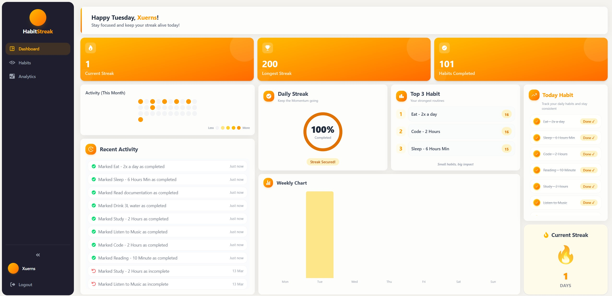 | 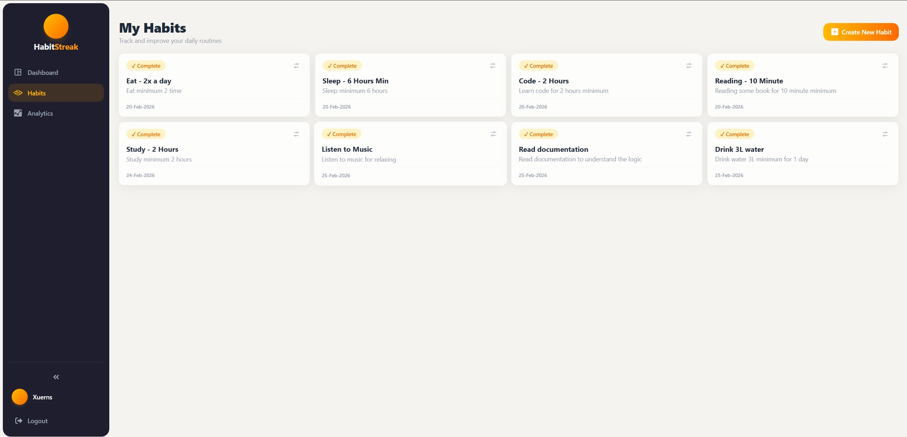 |  |

### Level 2 (10+ Days Streak)
| Dashboard | Habits | Analytics |
| :---: | :---: | :---: |
| 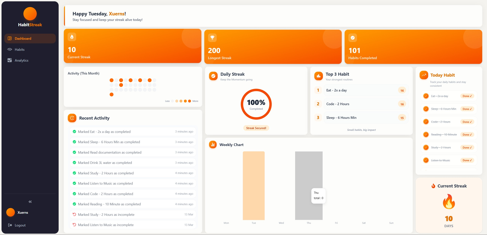 | 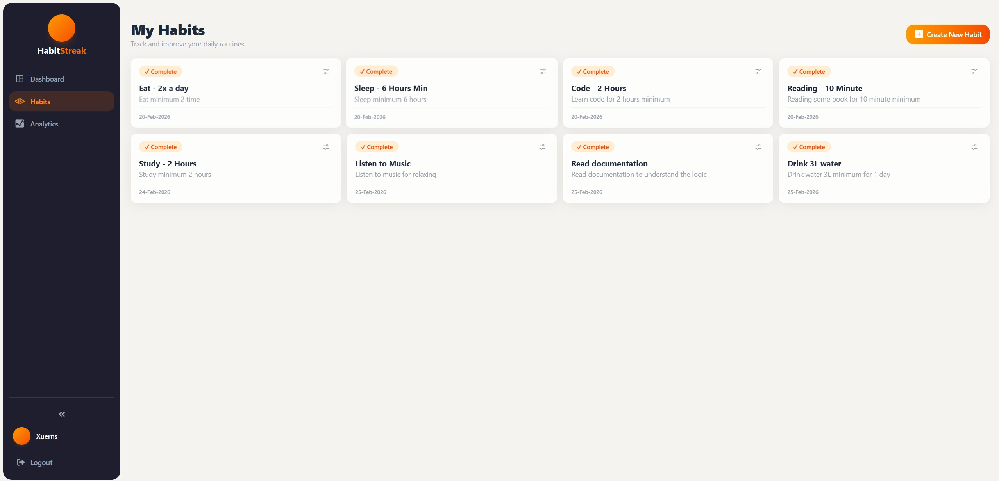 | 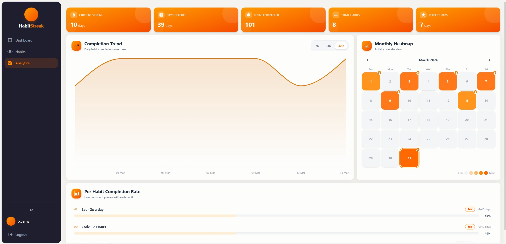 |

### Level 3 (20+ Days Streak)
| Dashboard | Habits | Analytics |
| :---: | :---: | :---: |
| 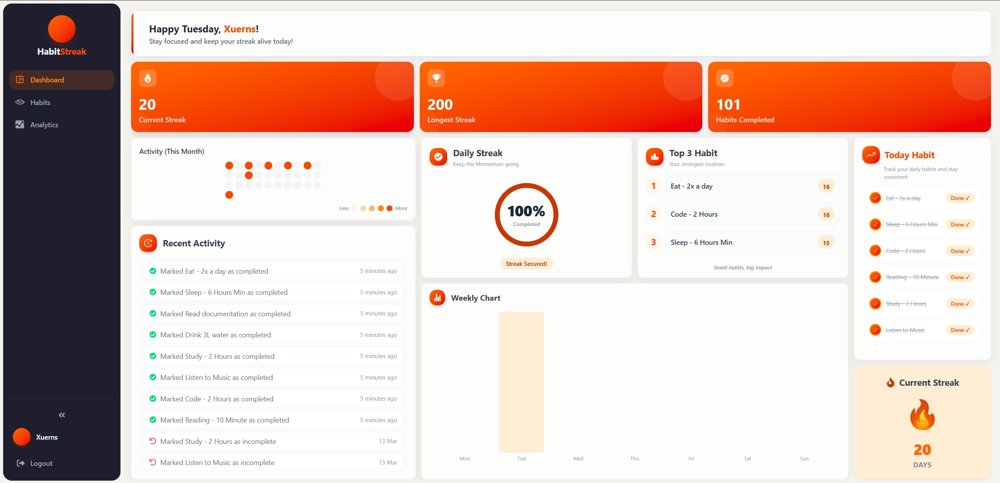 | 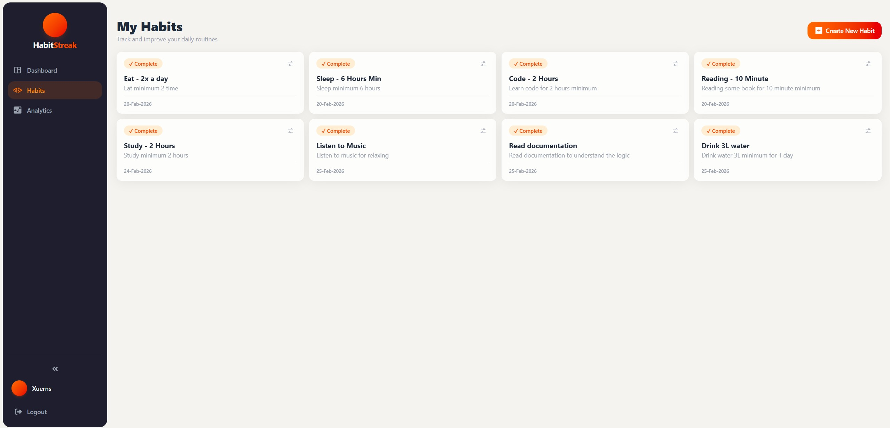 | 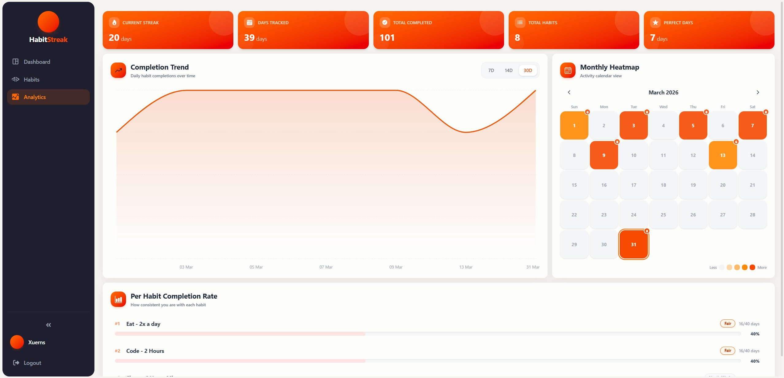 |

### Level 4 (50+ Days Streak)
| Dashboard | Habits | Analytics |
| :---: | :---: | :---: |
| 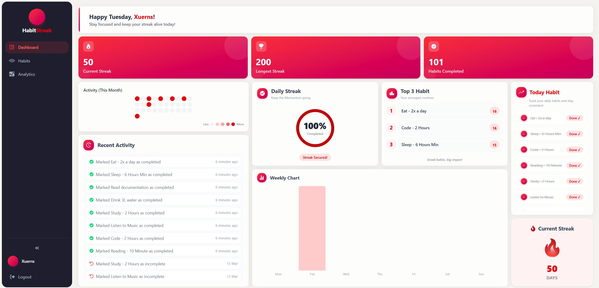 | 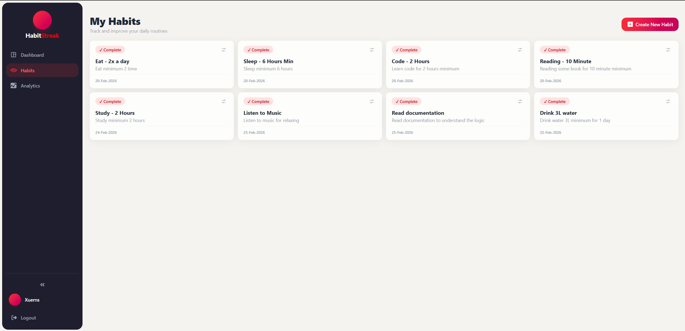 | 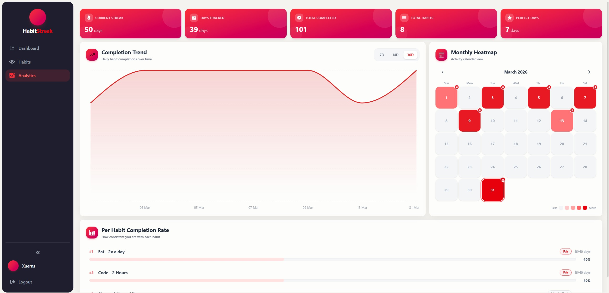 |

### Level 5 (100+ Days Streak)
| Dashboard | Habits | Analytics |
| :---: | :---: | :---: |
| 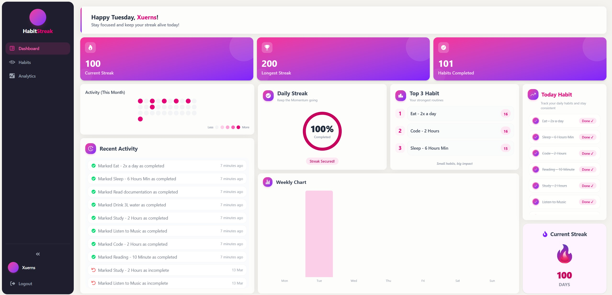 | 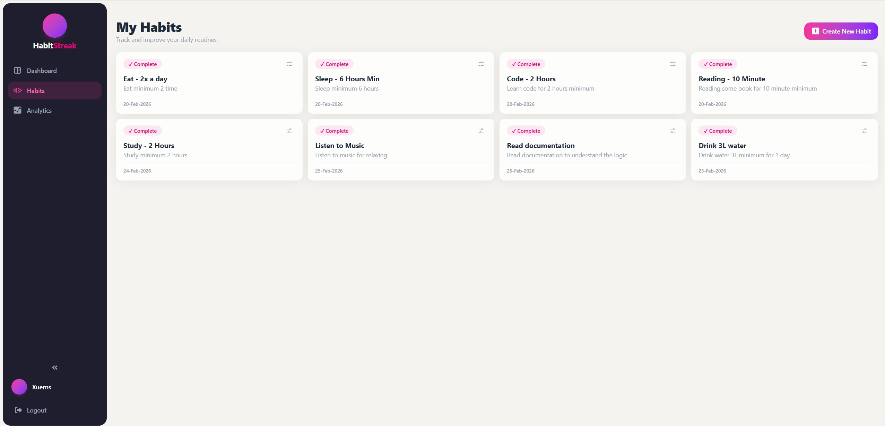 | 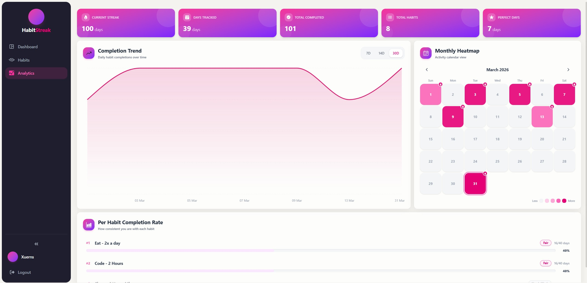 |

### Level 6 (200+ Days Streak - Master Tier)
| Dashboard | Habits | Analytics |
| :---: | :---: | :---: |
| 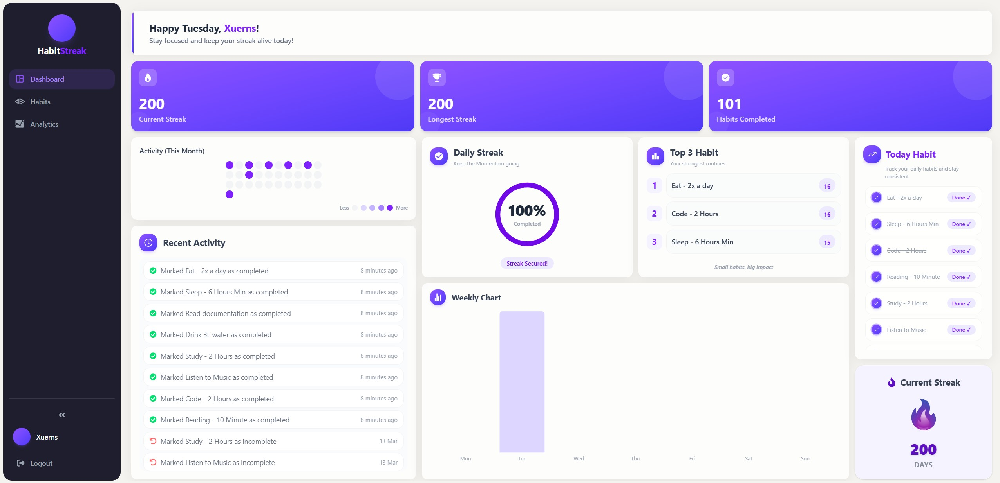 | 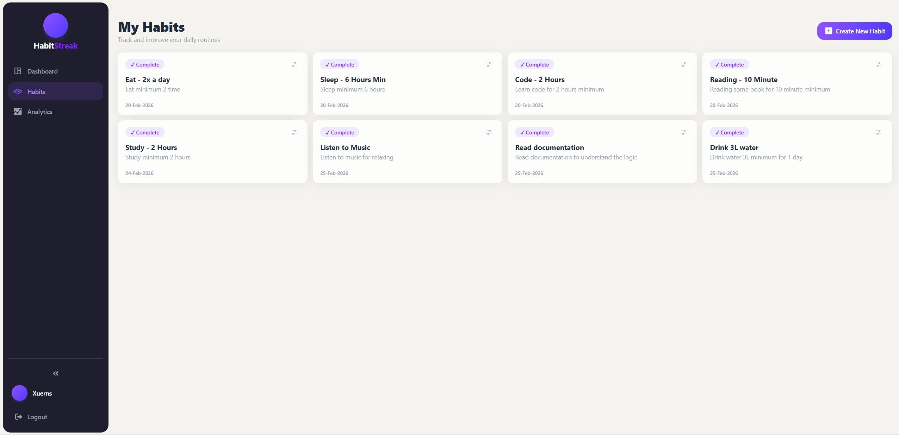 | 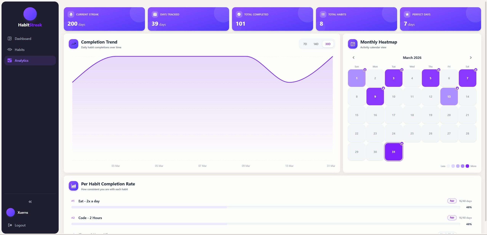 |

---

## Contributing

Contributions, issues, and feature requests are welcome! If you're interested in contributing or exploring the codebase locally, follow the steps below.

### 1. Clone the repo

```bash
git clone https://github.com/Xuerns/HabitStreak.git
cd HabitStreak
```

### 2. Install dependencies

```bash
# Install backend dependencies
cd backend && npm install

# Install frontend dependencies
cd ../frontend && npm install
```

### 3. Run the development environment

Run the backend and frontend servers in separate terminal sessions:

```bash
# Terminal 1 - Backend (Node.js & Express API on port 3000)
cd backend
npm run dev

# Terminal 2 - Frontend (Vite & React dev server on port 5173)
cd frontend
npm run dev
```

### 4. Run linting & type checks

Before submitting code, ensure that all linting and type checks pass:

```bash
# In frontend directory:
npm run lint
npm run build

# In backend directory:
npx tsc --noEmit
```

### 5. Submit a pull request

1. **Fork** the repository on GitHub.
2. **Create a branch** for your feature or bug fix:
   ```bash
   git checkout -b feature/your-feature-name
   ```
3. **Commit** your changes following meaningful commit conventions:
   ```bash
   git commit -m 'feat: add habit archiving capability'
   ```
4. **Push** your branch to your remote fork:
   ```bash
   git push origin feature/your-feature-name
   ```
5. **Open a Pull Request** to the `main` branch with a clear summary of your changes and any relevant issue references.

---

## License

This project is licensed under the [MIT License](LICENSE).